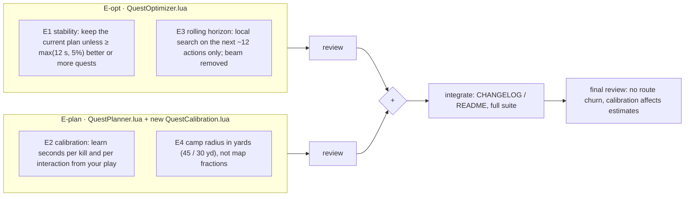

# flowchart

Captured 2026-11-17T22:51:06.439Z - run r-20261117-234605-6ba9

```mermaid
flowchart LR
  subgraph EO["E-opt · QuestOptimizer.lua"]
    E1["E1 stability: keep the current plan unless ≥ max(12 s, 5%) better or more quests"]
    E3["E3 rolling horizon: local search on the next ~12 actions only; beam removed"]
  end
  subgraph EP["E-plan · QuestPlanner.lua + new QuestCalibration.lua"]
    E2["E2 calibration: learn seconds per kill and per interaction from your play"]
    E4["E4 camp radius in yards (45 / 30 yd), not map fractions"]
  end
  EO --> RO["review"] --> J{"+"}
  EP --> RP["review"] --> J
  J --> I["integrate: CHANGELOG / README, full suite"] --> F["final review: no route churn, calibration affects estimates"]
```
