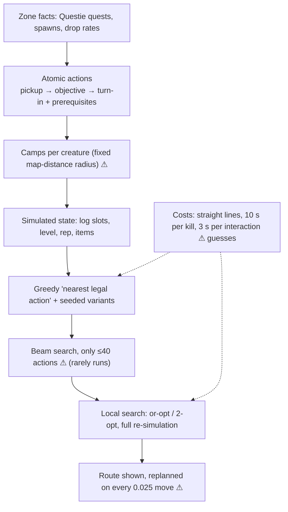

# flowchart

Captured 2026-11-17T22:47:50.807Z - run r-20261117-234605-6ba9

```mermaid
flowchart TD
  F["Zone facts: Questie quests, spawns, drop rates"] --> A["Atomic actions<br/>pickup → objective → turn-in + prerequisites"]
  A --> C["Camps per creature (fixed map-distance radius) ⚠"]
  C --> S["Simulated state: log slots, level, rep, items"]
  S --> G["Greedy 'nearest legal action' + seeded variants"]
  G --> B["Beam search, only ≤40 actions ⚠ (rarely runs)"]
  B --> L["Local search: or-opt / 2-opt, full re-simulation"]
  L --> R["Route shown, replanned on every 0.025 move ⚠"]
  K["Costs: straight lines, 10 s per kill, 3 s per interaction ⚠ guesses"] -.-> G & L
```
