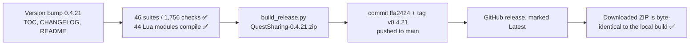

# flowchart

Captured 2026-11-17T19:50:34.365Z - run r-20261117-204730-a47b

```mermaid
flowchart LR
    A[Version bump 0.4.21<br/>TOC, CHANGELOG, README] --> B[46 suites / 1,756 checks ✅<br/>44 Lua modules compile ✅]
    B --> C[build_release.py<br/>QuestSharing-0.4.21.zip]
    C --> D[commit ffa2424 + tag v0.4.21<br/>pushed to main]
    D --> E[GitHub release, marked Latest]
    E --> F[Downloaded ZIP is byte-identical to the local build ✅]
```
