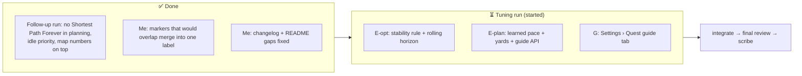

# flowchart

Captured 2026-11-17T23:19:06.962Z - run r-20261118-001852-fd7d

```mermaid
flowchart LR
  subgraph Done["✅ Done"]
    A["Follow-up run: no Shortest Path Forever in planning,<br/>idle priority, map numbers on top"]
    B["Me: markers that would overlap merge into one label"]
    C["Me: changelog + README gaps fixed"]
  end
  subgraph Now["⏳ Tuning run (started)"]
    E1["E-opt: stability rule + rolling horizon"]
    E2["E-plan: learned pace + yards + guide API"]
    G["G: Settings › Quest guide tab"]
  end
  Done --> Now --> I["integrate → final review → scribe"]
```
