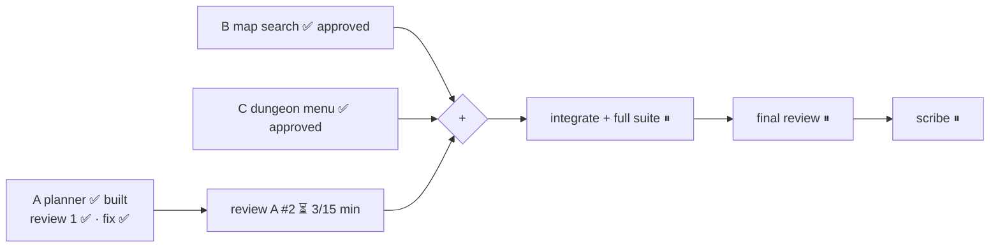

# flowchart

Captured 2026-11-17T22:19:19.144Z - run r-20261117-215940-e171

```mermaid
flowchart LR
  A["A planner ✅ built<br/>review 1 ✅ · fix ✅"] --> RA["review A #2 ⏳ 3/15 min"]
  B["B map search ✅ approved"] --> J{"+"}
  C["C dungeon menu ✅ approved"] --> J
  RA --> J
  J --> I["integrate + full suite ⏸"] --> F["final review ⏸"] --> S["scribe ⏸"]
```
