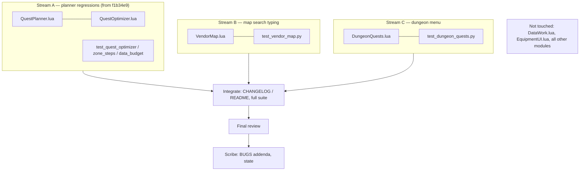

# flowchart

Captured 2026-11-17T20:57:43.068Z - run r-20261117-215352-bc74

```mermaid
flowchart TD
  subgraph A["Stream A — planner regressions (from f1b34e9)"]
    QP[QuestPlanner.lua] --- QO[QuestOptimizer.lua]
    TA[test_quest_optimizer / zone_steps / data_budget]
  end
  subgraph B["Stream B — map search typing"]
    VM[VendorMap.lua] --- TB[test_vendor_map.py]
  end
  subgraph C["Stream C — dungeon menu"]
    DQ[DungeonQuests.lua] --- TC[test_dungeon_quests.py]
  end
  A & B & C --> I["Integrate: CHANGELOG / README, full suite"] --> R["Final review"] --> S["Scribe: BUGS addenda, state"]
  X["Not touched: DataWork.lua, EquipmentUI.lua, all other modules"]
```
