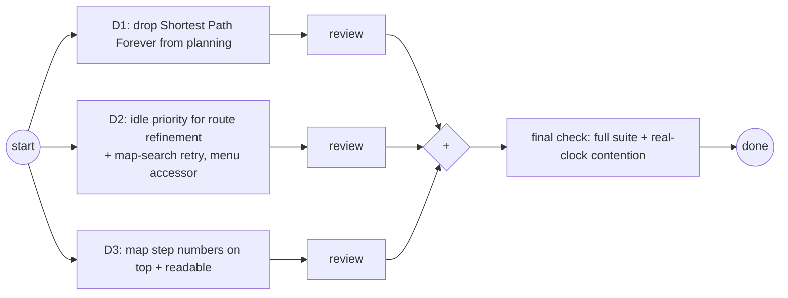

# flowchart

Captured 2026-11-17T22:44:57.951Z - run r-20261117-215940-e171

```mermaid
flowchart LR
  S((start)) --> D1["D1: drop Shortest Path Forever from planning"] --> R1["review"] --> J{"+"}
  S --> D2["D2: idle priority for route refinement<br/>+ map-search retry, menu accessor"] --> R2["review"] --> J
  S --> D3["D3: map step numbers on top + readable"] --> R3["review"] --> J
  J --> F["final check: full suite + real-clock contention"] --> E((done))
```
