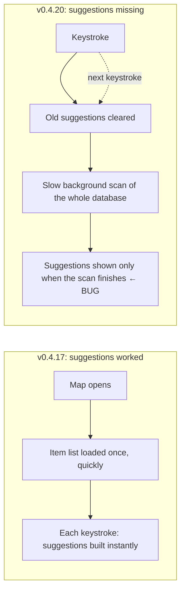

# flowchart

Captured 2026-11-17T19:33:21.074Z - run r-20261117-203311-0362

```mermaid
flowchart LR
    subgraph Before["v0.4.17: suggestions worked"]
        A1[Map opens] --> A2[Item list loaded once, quickly]
        A2 --> A3[Each keystroke: suggestions built instantly]
    end
    subgraph Now["v0.4.20: suggestions missing"]
        B1[Keystroke] --> B2[Old suggestions cleared]
        B2 --> B3[Slow background scan of the whole database]
        B3 --> B4[Suggestions shown only when the scan finishes ← BUG]
        B1 -. next keystroke .-> B2
    end
```
