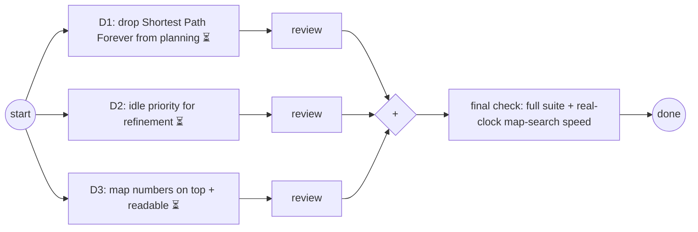

# flowchart

Captured 2026-11-17T22:46:18.867Z - run r-20261117-234605-6ba9

```mermaid
flowchart LR
  S((start)) --> D1["D1: drop Shortest Path Forever from planning ⏳"] --> R1["review"] --> J{"+"}
  S --> D2["D2: idle priority for refinement ⏳"] --> R2["review"] --> J
  S --> D3["D3: map numbers on top + readable ⏳"] --> R3["review"] --> J
  J --> F["final check: full suite + real-clock map-search speed"] --> E((done))
```
