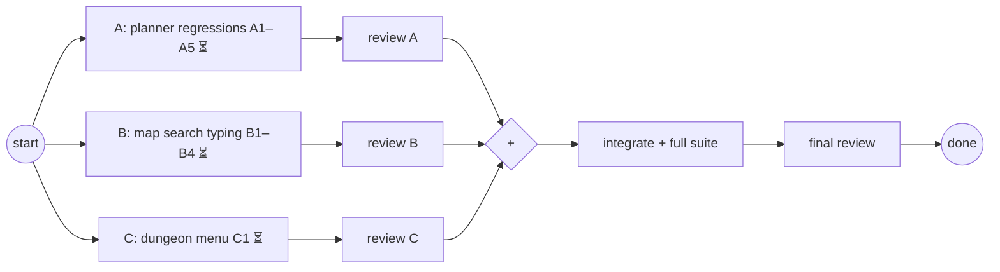

# flowchart

Captured 2026-11-17T21:00:03.496Z - run r-20261117-215940-e171

```mermaid
flowchart LR
  S((start)) --> A["A: planner regressions A1–A5 ⏳"] --> RA["review A"] --> J{"+"}
  S --> B["B: map search typing B1–B4 ⏳"] --> RB["review B"] --> J
  S --> C["C: dungeon menu C1 ⏳"] --> RC["review C"] --> J
  J --> I["integrate + full suite"] --> F["final review"] --> E((done))
```
