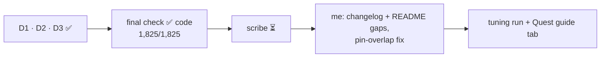

# flowchart

Captured 2026-11-17T23:09:29.847Z - run r-20261117-234605-6ba9

```mermaid
flowchart LR
  D["D1 · D2 · D3 ✅"] --> F["final check ✅ code<br/>1,825/1,825"] --> S["scribe ⏳"] --> M["me: changelog + README gaps,<br/>pin-overlap fix"] --> T["tuning run + Quest guide tab"]
```
