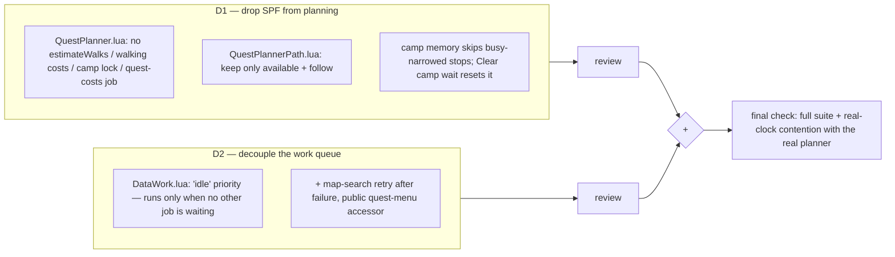

# flowchart

Captured 2026-11-17T22:37:05.309Z - run r-20261117-215940-e171

```mermaid
flowchart LR
  subgraph D1["D1 — drop SPF from planning"]
    P1["QuestPlanner.lua: no estimateWalks / walking costs / camp lock / quest-costs job"]
    P2["QuestPlannerPath.lua: keep only available + follow"]
    P3["camp memory skips busy-narrowed stops; Clear camp wait resets it"]
  end
  subgraph D2["D2 — decouple the work queue"]
    W1["DataWork.lua: 'idle' priority — runs only when no other job is waiting"]
    W2["+ map-search retry after failure, public quest-menu accessor"]
  end
  D1 --> R1["review"] --> J{"+"}
  D2 --> R2["review"] --> J
  J --> F["final check: full suite + real-clock contention with the real planner"]
```
