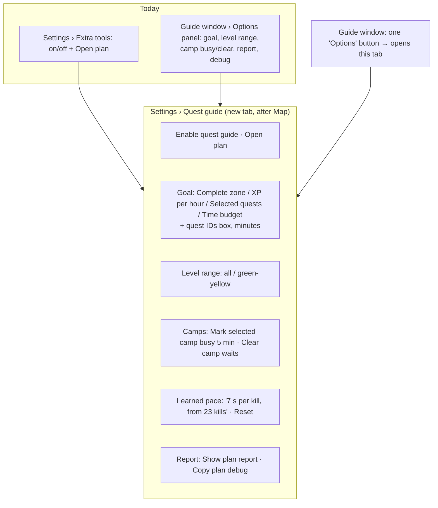

# flowchart

Captured 2026-11-17T22:57:53.829Z - run r-20261117-234605-6ba9

```mermaid
flowchart TD
  subgraph Today
    X["Settings › Extra tools: on/off + Open plan"]
    Y["Guide window › Options panel: goal, level range,<br/>camp busy/clear, report, debug"]
  end
  subgraph After["Settings › Quest guide (new tab, after Map)"]
    T1["Enable quest guide · Open plan"]
    T2["Goal: Complete zone / XP per hour / Selected quests / Time budget<br/>+ quest IDs box, minutes"]
    T3["Level range: all / green-yellow"]
    T4["Camps: Mark selected camp busy 5 min · Clear camp waits"]
    T5["Learned pace: '7 s per kill, from 23 kills' · Reset"]
    T6["Report: Show plan report · Copy plan debug"]
  end
  X --> After
  Y --> After
  G["Guide window: one 'Options' button → opens this tab"] --> After
```
