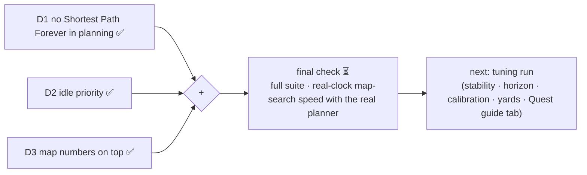

# flowchart

Captured 2026-11-17T23:03:00.608Z - run r-20261117-234605-6ba9

```mermaid
flowchart LR
  D1["D1 no Shortest Path Forever in planning ✅"] --> J{"+"}
  D2["D2 idle priority ✅"] --> J
  D3["D3 map numbers on top ✅"] --> J
  J --> F["final check ⏳<br/>full suite · real-clock map-search speed with the real planner"]
  F --> T["next: tuning run<br/>(stability · horizon · calibration · yards · Quest guide tab)"]
```
