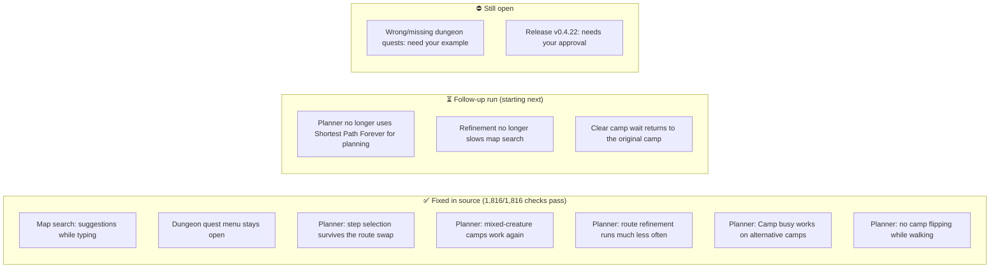

# flowchart

Captured 2026-11-17T22:42:05.027Z - run r-20261117-215940-e171

```mermaid
flowchart LR
  subgraph Fixed["✅ Fixed in source (1,816/1,816 checks pass)"]
    M["Map search: suggestions while typing"]
    D["Dungeon quest menu stays open"]
    P1["Planner: step selection survives the route swap"]
    P3["Planner: mixed-creature camps work again"]
    P4["Planner: route refinement runs much less often"]
    P5["Planner: Camp busy works on alternative camps"]
    P2["Planner: no camp flipping while walking"]
  end
  subgraph Next["⏳ Follow-up run (starting next)"]
    S["Planner no longer uses Shortest Path Forever for planning"]
    Q["Refinement no longer slows map search"]
    C["Clear camp wait returns to the original camp"]
  end
  subgraph Open["⛔ Still open"]
    W["Wrong/missing dungeon quests: need your example"]
    R["Release v0.4.22: needs your approval"]
  end
```
