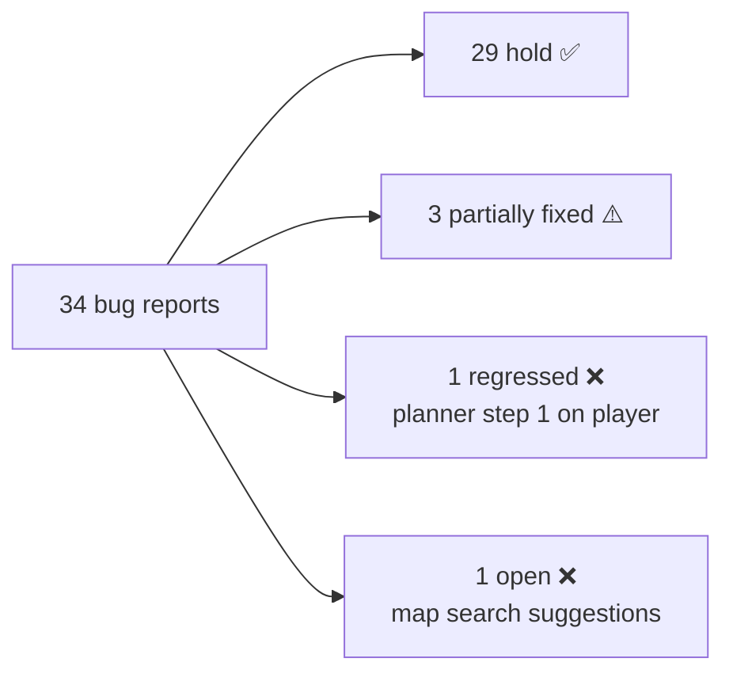

# flowchart

Captured 2026-11-17T20:48:44.304Z - run none

```mermaid
flowchart LR
  A["34 bug reports"] --> H["29 hold ✅"]
  A --> P["3 partially fixed ⚠️"]
  A --> R["1 regressed ❌<br/>planner step 1 on player"]
  A --> O["1 open ❌<br/>map search suggestions"]
```
