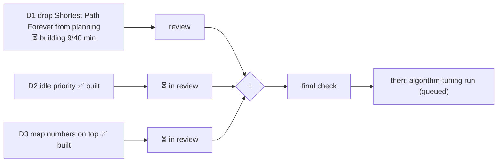

# flowchart

Captured 2026-11-17T22:56:07.830Z - run r-20261117-234605-6ba9

```mermaid
flowchart LR
  D1["D1 drop Shortest Path Forever from planning<br/>⏳ building 9/40 min"] --> R1["review"] --> J{"+"}
  D2["D2 idle priority ✅ built"] --> R2["⏳ in review"] --> J
  D3["D3 map numbers on top ✅ built"] --> R3["⏳ in review"] --> J
  J --> F["final check"] --> T["then: algorithm-tuning run (queued)"]
```
