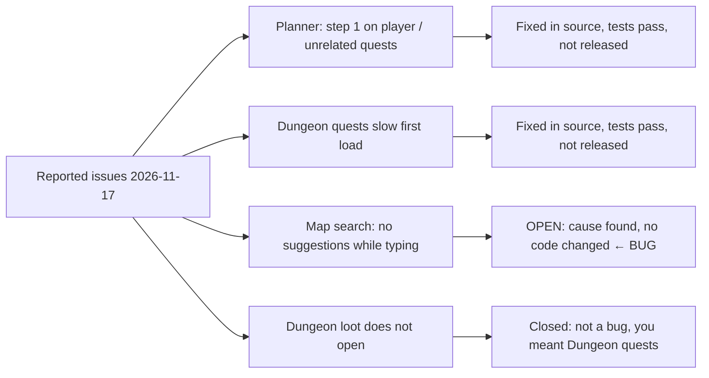

# flowchart

Captured 2026-11-17T19:46:05.671Z - run r-20261117-204417-a208

```mermaid
flowchart LR
    A[Reported issues 2026-11-17] --> B[Planner: step 1 on player / unrelated quests]
    A --> C[Dungeon quests slow first load]
    A --> D[Map search: no suggestions while typing]
    A --> E[Dungeon loot does not open]
    B --> B1[Fixed in source, tests pass, not released]
    C --> C1[Fixed in source, tests pass, not released]
    D --> D1[OPEN: cause found, no code changed ← BUG]
    E --> E1[Closed: not a bug, you meant Dungeon quests]
```
