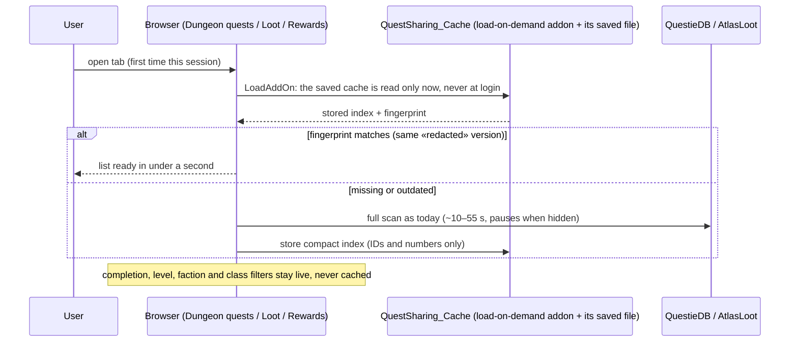

# sequenceDiagram

Captured 2026-11-17T19:34:07.181Z - run r-20261117-203326-c603

```mermaid
sequenceDiagram
    participant User
    participant D as Browser (Dungeon quests / Loot / Rewards)
    participant C as QuestSharing_Cache (load-on-demand addon + its saved file)
    participant Q as QuestieDB / AtlasLoot
    User->>D: open tab (first time this session)
    D->>C: LoadAddOn: the saved cache is read only now, never at login
    C-->>D: stored index + fingerprint
    alt fingerprint matches (same «redacted» version)
        D-->>User: list ready in under a second
    else missing or outdated
        D->>Q: full scan as today (~10–55 s, pauses when hidden)
        D->>C: store compact index (IDs and numbers only)
    end
    Note over D: completion, level, faction and class filters stay live, never cached
```
