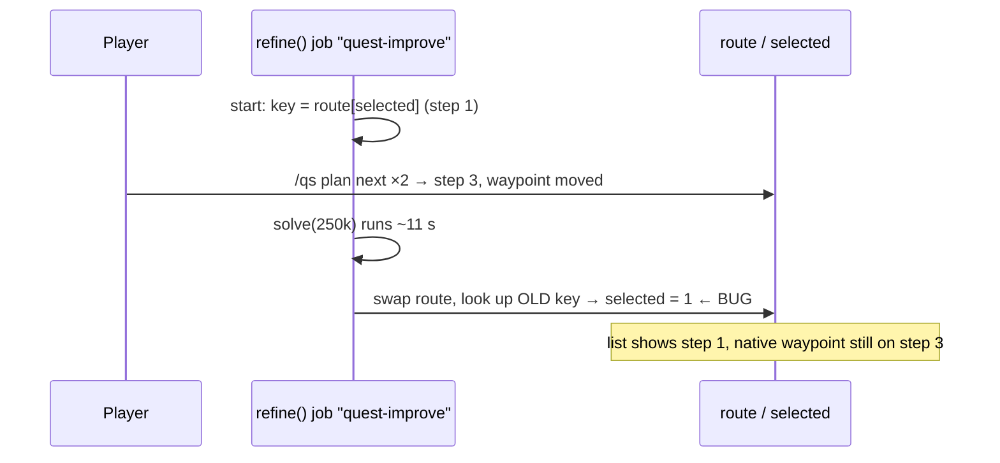

# sequenceDiagram

Captured 2026-11-17T20:34:12.628Z - run r-20261117-212533-cf04

```mermaid
sequenceDiagram
    participant U as Player
    participant J as refine() job "quest-improve"
    participant R as route / selected
    J->>J: start: key = route[selected] (step 1)
    U->>R: /qs plan next ×2 → step 3, waypoint moved
    J->>J: solve(250k) runs ~11 s
    J->>R: swap route, look up OLD key → selected = 1  ← BUG
    Note over R: list shows step 1, native waypoint still on step 3
```
