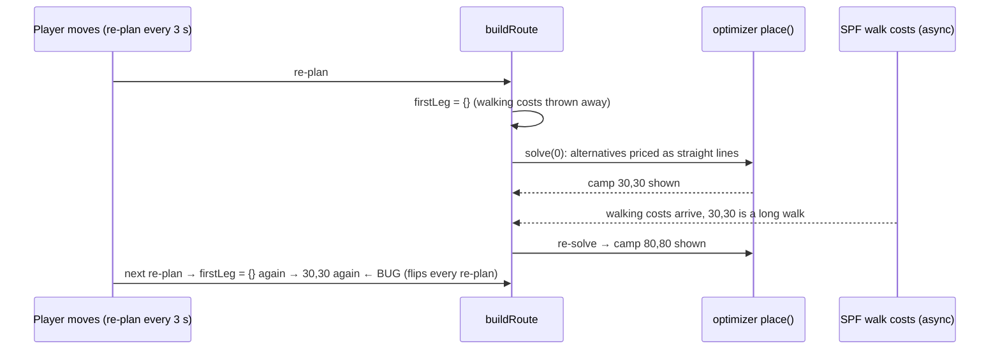

# sequenceDiagram

Captured 2026-11-17T20:38:57.200Z - run r-20261117-212533-cf04

```mermaid
sequenceDiagram
    participant P as Player moves (re-plan every 3 s)
    participant B as buildRoute
    participant O as optimizer place()
    participant S as SPF walk costs (async)
    P->>B: re-plan
    B->>B: firstLeg = {} (walking costs thrown away)
    B->>O: solve(0): alternatives priced as straight lines
    O-->>B: camp 30,30 shown
    S-->>B: walking costs arrive, 30,30 is a long walk
    B->>O: re-solve → camp 80,80 shown
    P->>B: next re-plan → firstLeg = {} again → 30,30 again  ← BUG (flips every re-plan)
```
