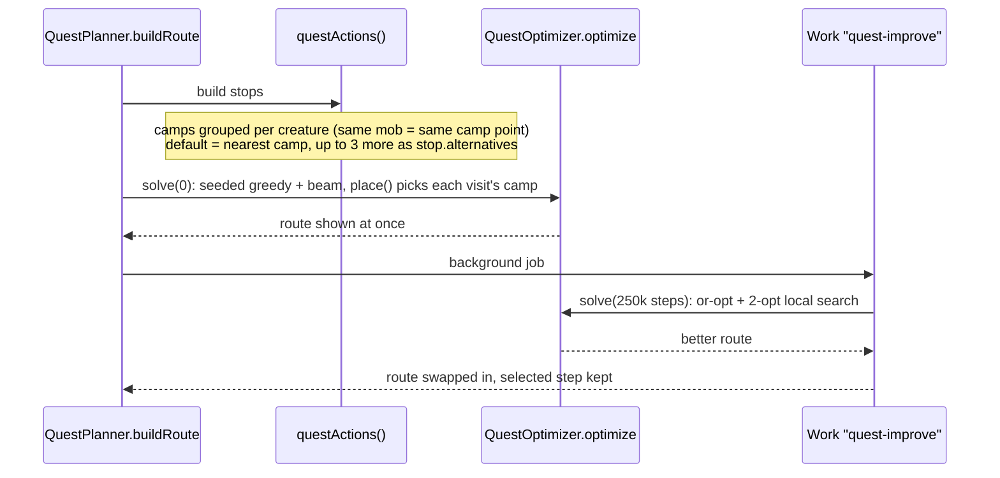

# sequenceDiagram

Captured 2026-11-17T20:01:33.216Z - run r-20261117-204917-0751

```mermaid
sequenceDiagram
    participant P as QuestPlanner.buildRoute
    participant QA as questActions()
    participant O as QuestOptimizer.optimize
    participant W as Work "quest-improve"
    P->>QA: build stops
    Note over QA: camps grouped per creature (same mob = same camp point)<br/>default = nearest camp, up to 3 more as stop.alternatives
    P->>O: solve(0): seeded greedy + beam, place() picks each visit's camp
    O-->>P: route shown at once
    P->>W: background job
    W->>O: solve(250k steps): or-opt + 2-opt local search
    O-->>W: better route
    W-->>P: route swapped in, selected step kept
```
