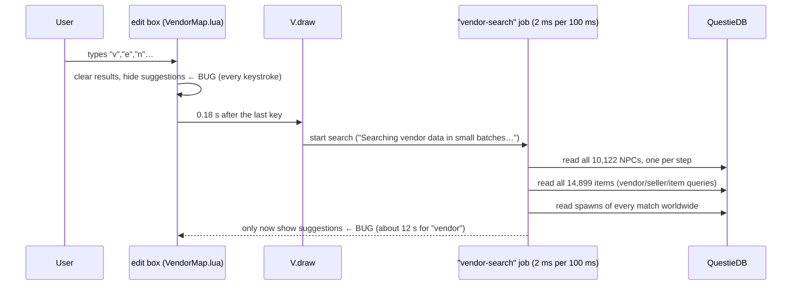

# sequenceDiagram

Captured 2026-11-17T19:29:12.225Z - run r-20261117-202126-650a

```mermaid
sequenceDiagram
    participant User
    participant Edit as edit box (VendorMap.lua)
    participant Draw as V.draw
    participant Job as "vendor-search" job (2 ms per 100 ms)
    participant DB as QuestieDB
    User->>Edit: types "v","e","n"…
    Edit->>Edit: clear results, hide suggestions  ← BUG (every keystroke)
    Edit->>Draw: 0.18 s after the last key
    Draw->>Job: start search ("Searching vendor data in small batches…")
    Job->>DB: read all 10,122 NPCs, one per step
    Job->>DB: read all 14,899 items (vendor/seller/item queries)
    Job->>DB: read spawns of every match worldwide
    Job-->>Edit: only now show suggestions  ← BUG (about 12 s for "vendor")
```
