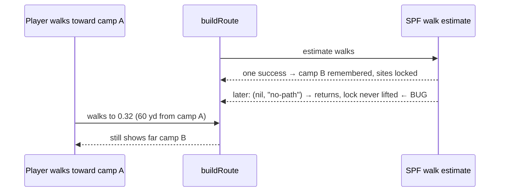

# sequenceDiagram

Captured 2026-11-17T21:46:59.447Z - run r-20261117-215940-e171

```mermaid
sequenceDiagram
    participant P as Player walks toward camp A
    participant B as buildRoute
    participant S as SPF walk estimate
    B->>S: estimate walks
    S-->>B: one success → camp B remembered, sites locked
    S-->>B: later: (nil, "no-path") → returns, lock never lifted  ← BUG
    P->>B: walks to 0.32 (60 yd from camp A)
    B-->>P: still shows far camp B
```
