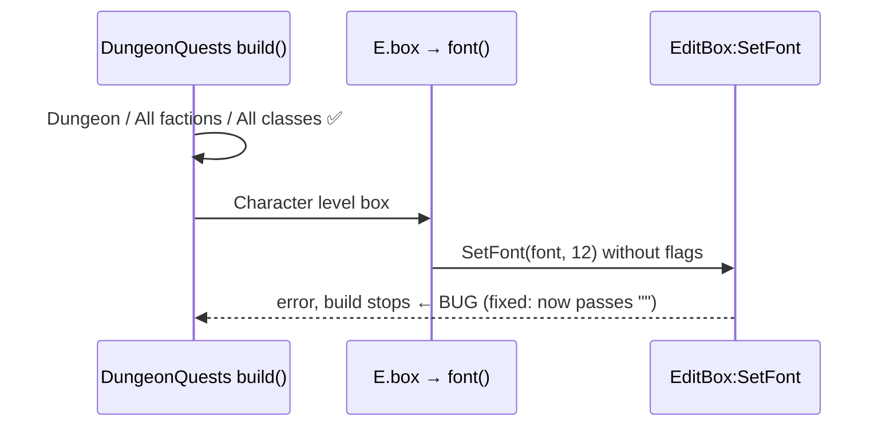

# sequenceDiagram

Captured 2026-11-17T20:03:18.191Z - run r-20261117-205838-bb0e

```mermaid
sequenceDiagram
    participant Build as DungeonQuests build()
    participant E as E.box → font()
    participant WoW as EditBox:SetFont
    Build->>Build: Dungeon / All factions / All classes ✅
    Build->>E: Character level box
    E->>WoW: SetFont(font, 12) without flags
    WoW-->>Build: error, build stops ← BUG (fixed: now passes "")
```
