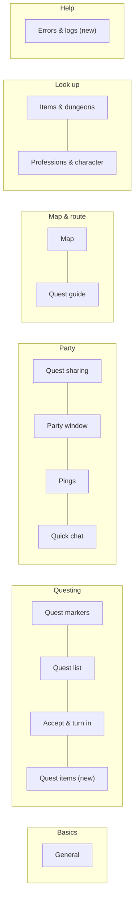

# flowchart

Captured 2026-11-18T08:49:33.899Z - run r-20261118-094109-b9c4

```mermaid
flowchart LR
    subgraph Basics
        G[General]
    end
    subgraph Questing
        O[Quest markers] --- T[Quest list] --- D[Accept & turn in] --- I["Quest items (new)"]
    end
    subgraph Party
        S[Quest sharing] --- P[Party window] --- A[Pings] --- Q[Quick chat]
    end
    subgraph "Map & route"
        M[Map] --- R[Quest guide]
    end
    subgraph "Look up"
        B[Items & dungeons] --- X[Professions & character]
    end
    subgraph Help
        H["Errors & logs (new)"]
    end
```
