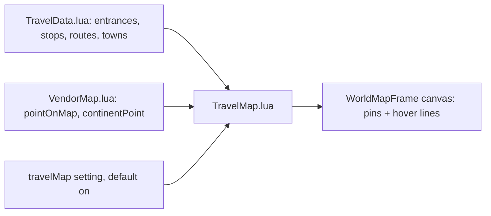

# flowchart

Captured 2026-11-18T09:21:52.794Z - run r-20261118-100815-ffd8

```mermaid
flowchart LR
    TravelData[TravelData.lua: entrances, stops, routes, towns] --> TravelMap[TravelMap.lua]
    VendorMap[VendorMap.lua: pointOnMap, continentPoint] --> TravelMap
    TravelMap --> Canvas[WorldMapFrame canvas: pins + hover lines]
    Setting[travelMap setting, default on] --> TravelMap
```
