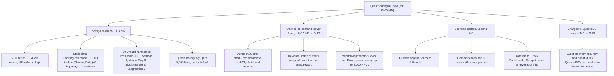

# flowchart

Captured 2026-11-18T12:00:16.392Z - run r-20261118-125841-9542

```mermaid
flowchart TD
    A["QuestSharing in RAM (est. 8–25 MB)"] --> B["Always resident, ~2–3 MB"]
    A --> C["Opened on demand, never freed, ~4–12 MB ← BUG"]
    A --> D["Bounded caches, under 1 MB"]
    A --> E["Charged to QuestieDB, tens of MB ← BUG"]

    B --> B1["50 Lua files, 1.04 MB source, all loaded at login"]
    B --> B2["Static data: CookingReference (~1,000 tables), SkinningData (47 big arrays), TravelData"]
    B --> B3["~90 CreateFrame sites: ProfessionUI 10, Settings 9, VendorMap 6, EquipmentUI 6, Diagnostics 6"]
    B --> B4["QuestSharingLog: up to 3,300 lines, on by default"]

    C --> C1["DungeonQuests: chainPrev, chainNext, depthOf, chainLead, records"]
    C --> C2["Rewards: index of every weapon/armor that is a quest reward"]
    C --> C3["VendorMap: vendors rows, itemRows, spawn cache up to 2,000 NPCs"]

    D --> D1["Questie appendSources: 256 slots"]
    D --> D2["GatherSources: top 3 zones × 40 points per item"]
    D --> D3["Professions, Track, ZoneLevels, Compat: reset on events or TTL"]

    E --> E1["Q.get on every npc, item and quest id fills QuestieDB's own cache for the whole session"]
```
