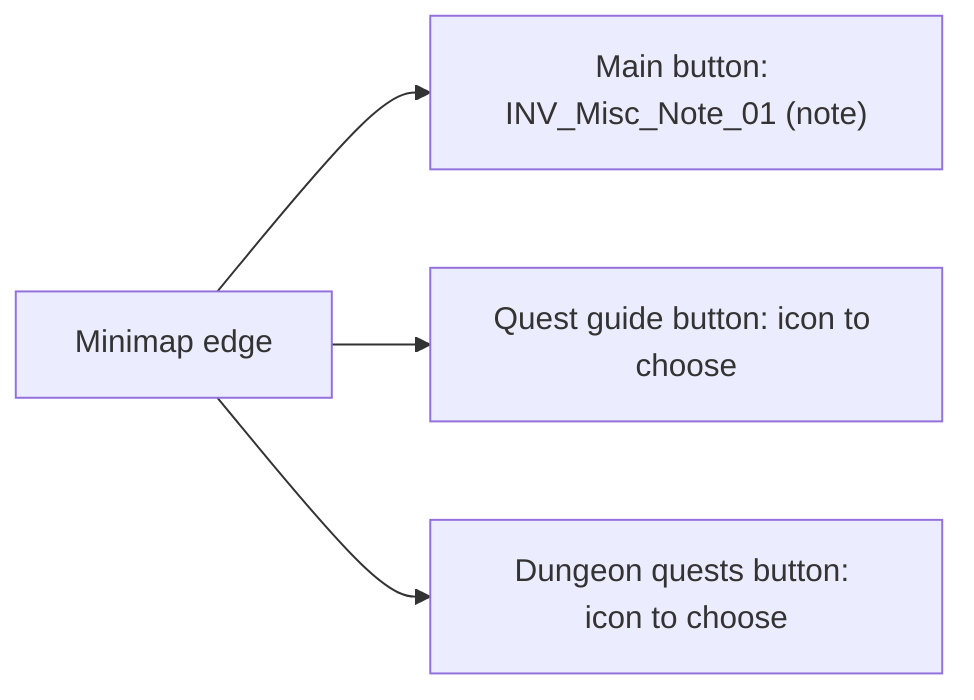

# flowchart

Captured 2026-11-18T09:57:41.275Z - run r-20261118-105711-8224

```mermaid
flowchart LR
    M[Minimap edge] --> B0["Main button: INV_Misc_Note_01 (note)"]
    M --> B1["Quest guide button: icon to choose"]
    M --> B2["Dungeon quests button: icon to choose"]
```
