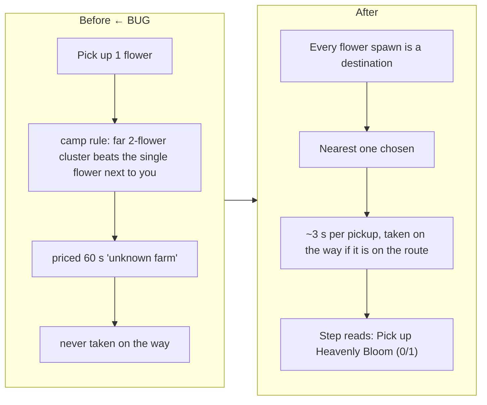

# flowchart

Captured 2026-11-18T20:03:03.887Z - run r-20261118-205411-fd96

```mermaid
flowchart LR
  subgraph Before["Before ← BUG"]
    A["Pick up 1 flower"] --> B["camp rule: far 2-flower cluster beats the single flower next to you"]
    B --> C["priced 60 s 'unknown farm'"] --> D["never taken on the way"]
  end
  subgraph After["After"]
    E["Every flower spawn is a destination"] --> F["Nearest one chosen"]
    F --> G["~3 s per pickup, taken on the way if it is on the route"]
    G --> H["Step reads: Pick up Heavenly Bloom (0/1)"]
  end
  Before --> After
```
