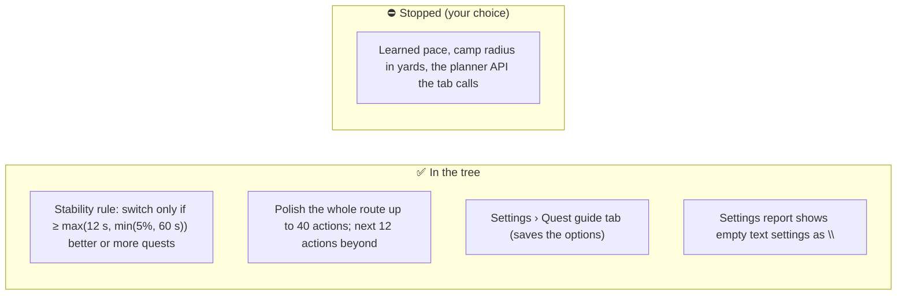

# flowchart

Captured 2026-11-18T06:58:00.453Z - run none

```mermaid
flowchart LR
  subgraph Done["✅ In the tree"]
    S["Stability rule: switch only if ≥ max(12 s, min(5%, 60 s)) better or more quests"]
    H["Polish the whole route up to 40 actions; next 12 actions beyond"]
    G["Settings › Quest guide tab (saves the options)"]
    L["Settings report shows empty text settings as \"\""]
  end
  subgraph NotDone["⛔ Stopped (your choice)"]
    P["Learned pace, camp radius in yards, the planner API the tab calls"]
  end
```
