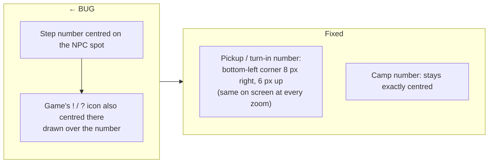

# flowchart

Captured 2026-11-18T19:16:37.412Z - run r-20261118-201310-a045

```mermaid
flowchart LR
  subgraph Before["← BUG"]
    N["Step number centred on the NPC spot"] --> I["Game's ! / ? icon also centred there<br/>drawn over the number"]
  end
  subgraph After["Fixed"]
    P["Pickup / turn-in number:<br/>bottom-left corner 8 px right, 6 px up<br/>(same on screen at every zoom)"]
    C["Camp number: stays exactly centred"]
  end
  Before --> After
```
