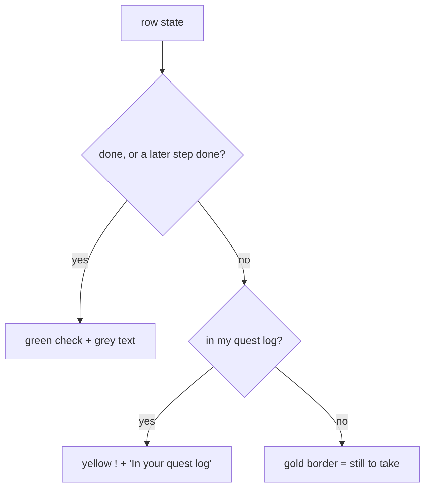

# flowchart

Captured 2026-11-18T11:38:27.275Z - run r-20261118-123047-e4f4

```mermaid
flowchart TD
    R[row state] --> D{done, or a later step done?}
    D -- yes --> T[green check + grey text]
    D -- no --> L{in my quest log?}
    L -- yes --> E["yellow ! + 'In your quest log'"]
    L -- no --> B[gold border = still to take]
```
