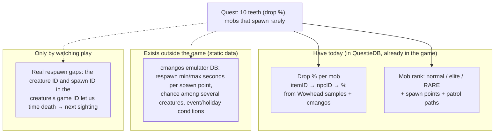

# flowchart

Captured 2026-11-18T19:44:54.824Z - run r-20261118-204212-186e

```mermaid
flowchart TD
  Q["Quest: 10 teeth (drop %), mobs that spawn rarely"]
  subgraph Have["Have today (in QuestieDB, already in the game)"]
    D["Drop % per mob<br/>itemID → npcID → %<br/>from Wowhead samples + cmangos"]
    R["Mob rank: normal / elite / RARE<br/>+ spawn points + patrol paths"]
  end
  subgraph Outside["Exists outside the game (static data)"]
    T["cmangos emulator DB: respawn min/max seconds per spawn point,<br/>chance among several creatures, event/holiday conditions"]
  end
  subgraph Learn["Only by watching play"]
    L["Real respawn gaps: the creature ID and spawn ID in the<br/>creature's game ID let us time death → next sighting"]
  end
  Q --> D & R
  Q -.-> T
  Q -.-> L
```
