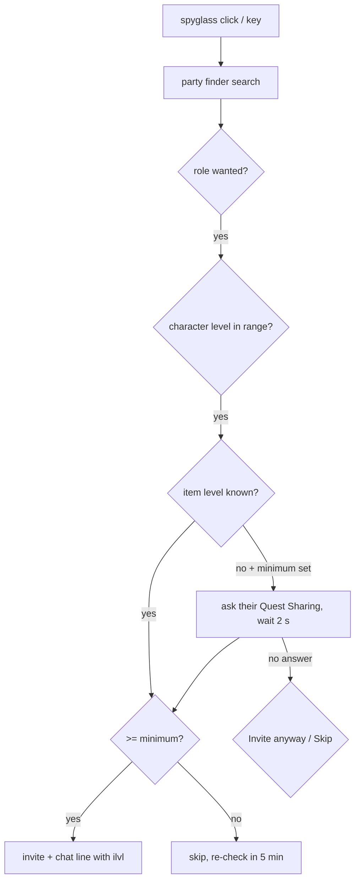

# flowchart

Captured 2026-11-18T21:51:47.035Z - run r-20261118-224540-a0d0

```mermaid
flowchart TD
    Click[spyglass click / key] --> Search[party finder search]
    Search --> Roles{role wanted?}
    Roles -->|yes| Lvl{character level in range?}
    Lvl -->|yes| Known{item level known?}
    Known -->|yes| Min{>= minimum?}
    Known -->|no + minimum set| Ask[ask their Quest Sharing, wait 2 s]
    Ask --> Min
    Ask -->|no answer| Unknown{Invite anyway / Skip}
    Min -->|yes| Invite[invite + chat line with ilvl]
    Min -->|no| Skip[skip, re-check in 5 min]
```
