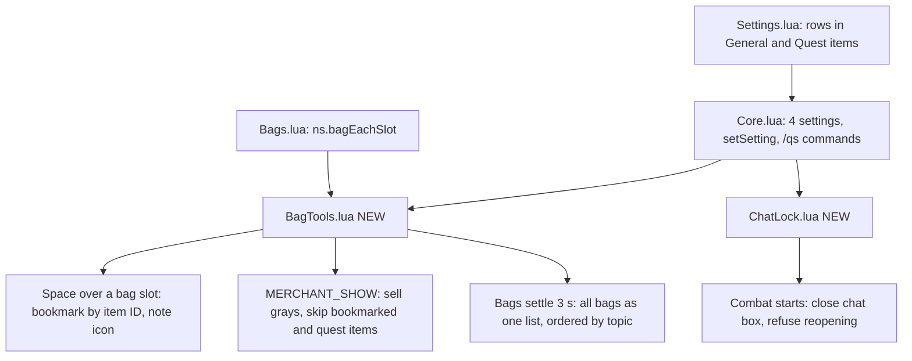

# flowchart

Captured 2026-11-18T11:40:49.223Z - run r-20261118-122506-37c1

```mermaid
flowchart TD
    Core[Core.lua: 4 settings, setSetting, /qs commands] --> BT[BagTools.lua NEW]
    Core --> CL[ChatLock.lua NEW]
    Bags[Bags.lua: ns.bagEachSlot] --> BT
    Settings[Settings.lua: rows in General and Quest items] --> Core
    BT --> Space[Space over a bag slot: bookmark by item ID, note icon]
    BT --> Sell[MERCHANT_SHOW: sell grays, skip bookmarked and quest items]
    BT --> Sort[Bags settle 3 s: all bags as one list, ordered by topic]
    CL --> Chat[Combat starts: close chat box, refuse reopening]
```
