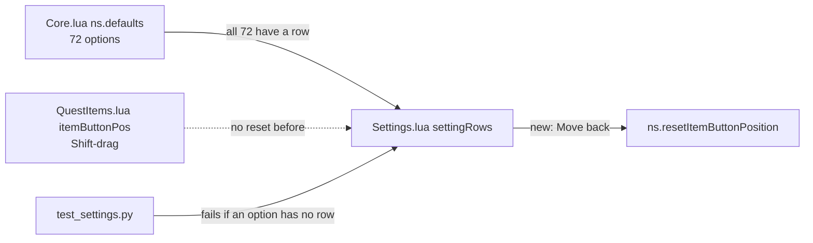

# flowchart

Captured 2026-11-18T19:40:35.240Z - run r-20261118-203725-33e6

```mermaid
flowchart LR
    D[Core.lua ns.defaults<br/>72 options] -->|all 72 have a row| S[Settings.lua settingRows]
    QI[QuestItems.lua itemButtonPos<br/>Shift-drag] -.->|no reset before| S
    S -->|new: Move back| R[ns.resetItemButtonPosition]
    T[test_settings.py] -->|fails if an option has no row| S
```
