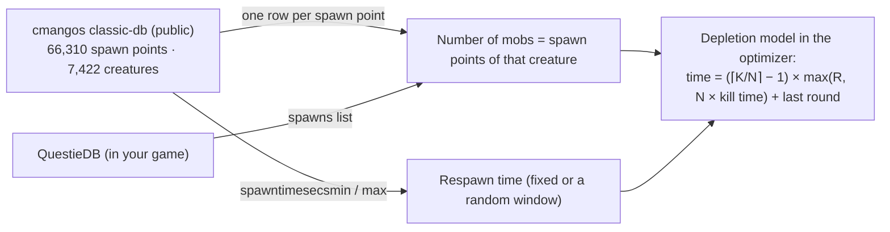

# flowchart

Captured 2026-11-18T19:49:50.641Z - run r-20261118-204809-2962

```mermaid
flowchart LR
  DB["cmangos classic-db (public)<br/>66,310 spawn points · 7,422 creatures"]
  DB -->|"one row per spawn point"| N["Number of mobs = spawn points of that creature"]
  DB -->|"spawntimesecsmin / max"| R["Respawn time (fixed or a random window)"]
  QD["QuestieDB (in your game)"] -->|"spawns list"| N
  N & R --> M["Depletion model in the optimizer:<br/>time = (⌈K/N⌉ − 1) × max(R, N × kill time) + last round"]
```
