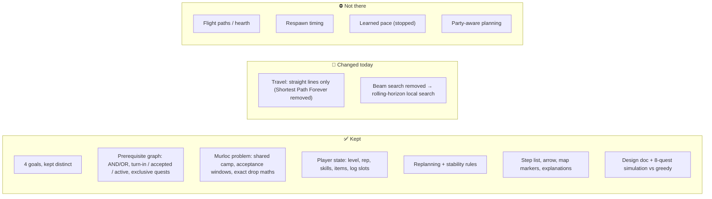

# flowchart

Captured 2026-11-18T07:03:28.363Z - run r-20261118-080217-2448

```mermaid
flowchart LR
  subgraph Kept["✅ Kept"]
    K1["4 goals, kept distinct"]
    K2["Prerequisite graph: AND/OR, turn-in / accepted / active, exclusive quests"]
    K3["Murloc problem: shared camp, acceptance windows, exact drop maths"]
    K4["Player state: level, rep, skills, items, log slots"]
    K5["Replanning + stability rules"]
    K6["Step list, arrow, map markers, explanations"]
    K7["Design doc + 8-quest simulation vs greedy"]
  end
  subgraph Changed["🔄 Changed today"]
    C1["Travel: straight lines only (Shortest Path Forever removed)"]
    C2["Beam search removed → rolling-horizon local search"]
  end
  subgraph Missing["⛔ Not there"]
    M1["Flight paths / hearth"]
    M2["Respawn timing"]
    M3["Learned pace (stopped)"]
    M4["Party-aware planning"]
  end
```
