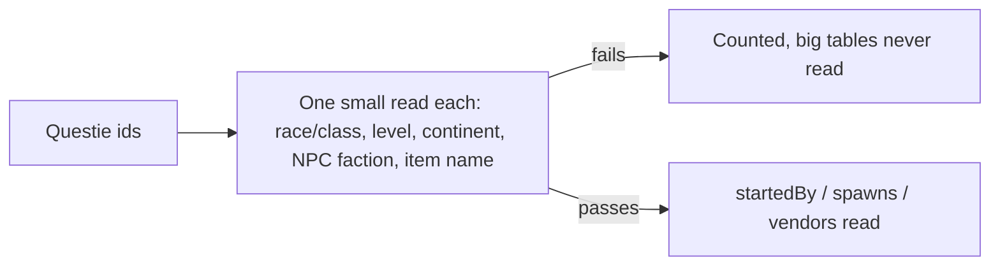

# flowchart

Captured 2026-11-18T10:29:32.893Z - run r-20261118-105025-b833

```mermaid
flowchart LR
    ids[Questie ids] --> gate[One small read each: race/class, level, continent, NPC faction, item name]
    gate -->|fails| skip[Counted, big tables never read]
    gate -->|passes| big[startedBy / spawns / vendors read]
```
