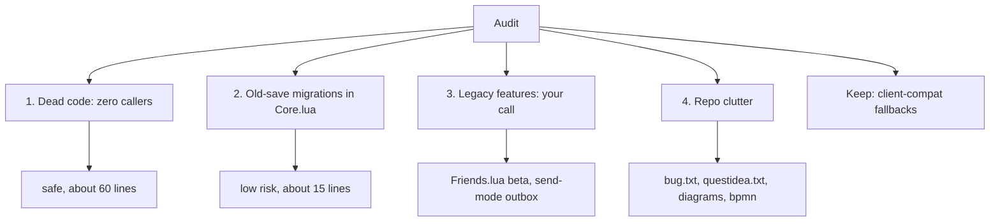

# flowchart

Captured 2026-11-18T11:51:59.800Z - run r-20261118-124934-0a5f

```mermaid
flowchart TD
    A[Audit] --> B[1. Dead code: zero callers]
    A --> C[2. Old-save migrations in Core.lua]
    A --> D[3. Legacy features: your call]
    A --> E[4. Repo clutter]
    A --> F[Keep: client-compat fallbacks]
    B --> B1[safe, about 60 lines]
    C --> C1[low risk, about 15 lines]
    D --> D1[Friends.lua beta, send-mode outbox]
    E --> E1[bug.txt, questidea.txt, diagrams, bpmn]
```
