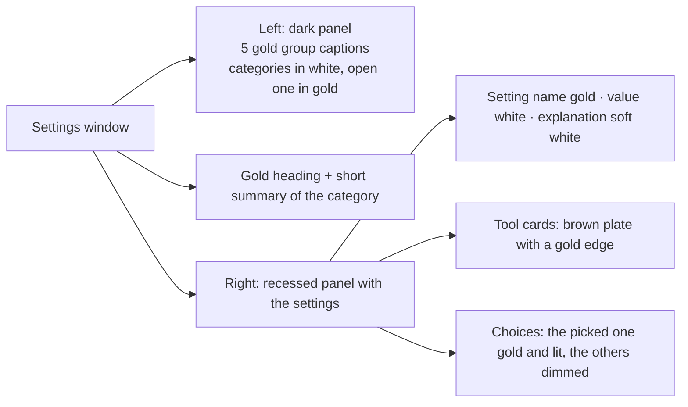

# flowchart

Captured 2026-11-18T07:04:42.981Z - run r-20261118-075809-9737

```mermaid
flowchart LR
    W[Settings window] --> SB[Left: dark panel<br/>5 gold group captions<br/>categories in white, open one in gold]
    W --> H[Gold heading + short summary of the category]
    W --> WL[Right: recessed panel with the settings]
    WL --> R[Setting name gold · value white · explanation soft white]
    WL --> C[Tool cards: brown plate with a gold edge]
    WL --> CH[Choices: the picked one gold and lit, the others dimmed]
```
