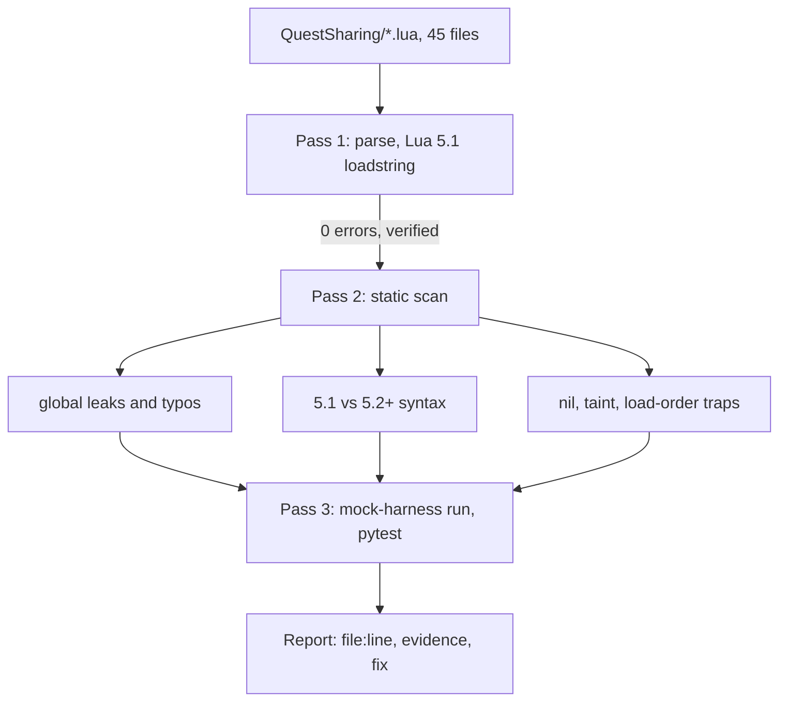

# flowchart

Captured 2026-11-18T08:46:58.285Z - run r-20261118-094549-8639

```mermaid
flowchart TD
    A[QuestSharing/*.lua, 45 files] --> B[Pass 1: parse, Lua 5.1 loadstring]
    B -->|0 errors, verified| C[Pass 2: static scan]
    C --> C1[global leaks and typos]
    C --> C2[5.1 vs 5.2+ syntax]
    C --> C3[nil, taint, load-order traps]
    C1 & C2 & C3 --> D[Pass 3: mock-harness run, pytest]
    D --> E[Report: file:line, evidence, fix]
```
