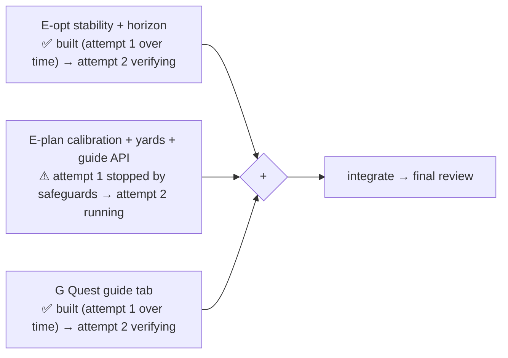

# flowchart

Captured 2026-11-18T00:32:12.871Z - run r-20261118-001852-fd7d

```mermaid
flowchart LR
  O["E-opt stability + horizon<br/>✅ built (attempt 1 over time) → attempt 2 verifying"] --> J{"+"}
  P["E-plan calibration + yards + guide API<br/>⚠ attempt 1 stopped by safeguards → attempt 2 running"] --> J
  G["G Quest guide tab<br/>✅ built (attempt 1 over time) → attempt 2 verifying"] --> J
  J --> I["integrate → final review"]
```
