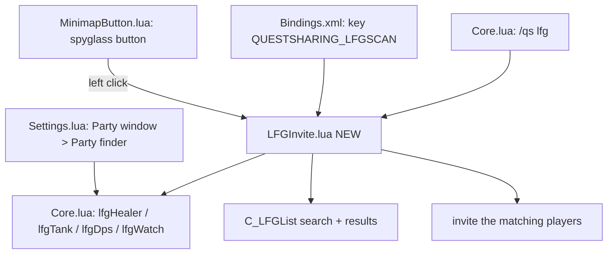

# flowchart

Captured 2026-11-18T20:41:08.189Z - run r-20261118-213549-f264

```mermaid
flowchart TD
    MB[MinimapButton.lua: spyglass button] -->|left click| L[LFGInvite.lua NEW]
    Key[Bindings.xml: key QUESTSHARING_LFGSCAN] --> L
    Slash[Core.lua: /qs lfg] --> L
    Set[Settings.lua: Party window > Party finder] --> DB[Core.lua: lfgHealer / lfgTank / lfgDps / lfgWatch]
    L --> DB
    L --> API[C_LFGList search + results]
    L --> Inv[invite the matching players]
```
