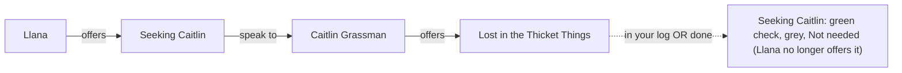

# flowchart

Captured 2026-11-18T20:20:30.854Z - run r-20261118-211809-3c02

```mermaid
flowchart LR
    LL[Llana] -->|offers| SC[Seeking Caitlin]
    SC -->|speak to| CG[Caitlin Grassman]
    CG -->|offers| LT[Lost in the Thicket Things]
    LT -. "in your log OR done" .-> SC2["Seeking Caitlin: green check, grey, Not needed (Llana no longer offers it)"]
```
