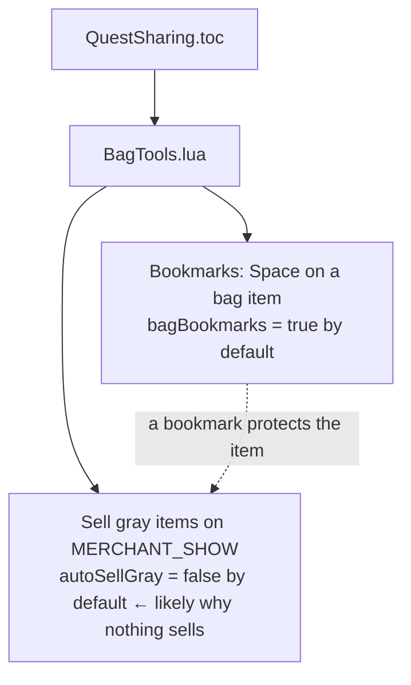

# flowchart

Captured 2026-11-18T19:04:30.055Z - run r-20261118-200401-daa1

```mermaid
flowchart TD
    TOC[QuestSharing.toc] --> BT[BagTools.lua]
    BT --> BM["Bookmarks: Space on a bag item<br/>bagBookmarks = true by default"]
    BT --> AS["Sell gray items on MERCHANT_SHOW<br/>autoSellGray = false by default ← likely why nothing sells"]
    BM -. a bookmark protects the item .-> AS
```
