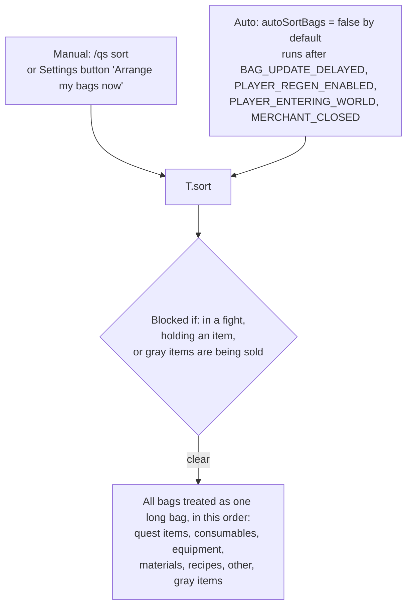

# flowchart

Captured 2026-11-18T19:05:51.488Z - run r-20261118-200540-6724

```mermaid
flowchart TD
    M["Manual: /qs sort<br/>or Settings button 'Arrange my bags now'"] --> S[T.sort]
    A["Auto: autoSortBags = false by default<br/>runs after BAG_UPDATE_DELAYED, PLAYER_REGEN_ENABLED,<br/>PLAYER_ENTERING_WORLD, MERCHANT_CLOSED"] --> S
    S --> G{"Blocked if: in a fight,<br/>holding an item,<br/>or gray items are being sold"}
    G -->|clear| O["All bags treated as one long bag, in this order:<br/>quest items, consumables, equipment,<br/>materials, recipes, other, gray items"]
```
