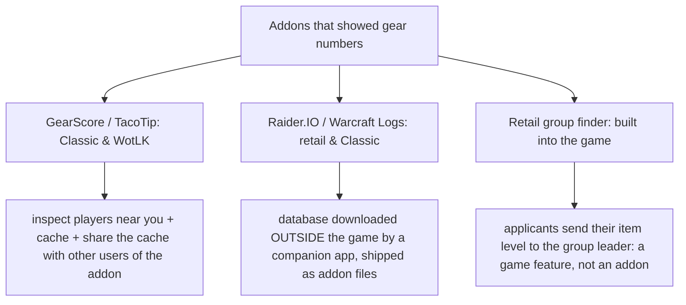

# flowchart

Captured 2026-11-18T21:44:42.840Z - run r-20261118-224426-2c73

```mermaid
flowchart TD
    A[Addons that showed gear numbers] --> B[GearScore / TacoTip: Classic & WotLK]
    A --> C[Raider.IO / Warcraft Logs: retail & Classic]
    A --> D[Retail group finder: built into the game]
    B --> B1[inspect players near you + cache + share the cache with other users of the addon]
    C --> C1[database downloaded OUTSIDE the game by a companion app, shipped as addon files]
    D --> D1[applicants send their item level to the group leader: a game feature, not an addon]
```
