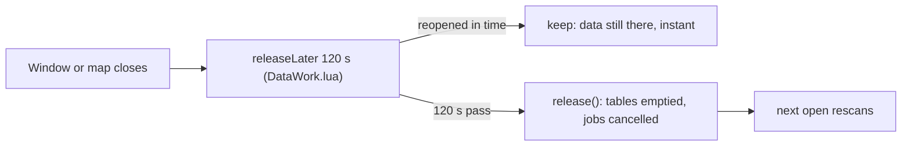

# flowchart

Captured 2026-11-18T13:30:26.559Z - run r-20261118-141955-e68c

```mermaid
flowchart LR
    Close["Window or map closes"] --> T["releaseLater 120 s (DataWork.lua)"]
    T -->|reopened in time| Keep["keep: data still there, instant"]
    T -->|120 s pass| Free["release(): tables emptied, jobs cancelled"]
    Free --> Next["next open rescans"]
```
